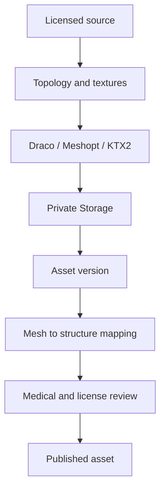

# 3D asset pipeline

Assets are separated by system rather than one high-resolution body file. `three_d_assets` owns logical asset metadata; `three_d_asset_versions` records binaries, LOD, checksum, and compression. `mesh_mappings` connects mesh names to stable anatomical IDs.

`ModelLoader` dynamically loads GLTF dependencies. `AssetCacheManager` prevents repeat network loading and returns safely cloned render objects. Scene teardown disposes cloned geometry, materials, and textures. Mobile quality reduces pixel ratio; simplified full-body geometry is the default overview.

An asset cannot be published without a known license and attribution. Unknown mesh names may render but cannot select medical content and must appear in the CMS coverage report.
