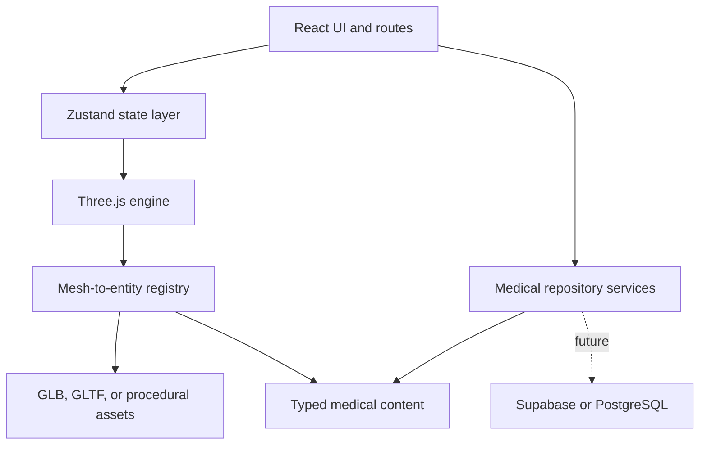

# Architecture

## Layer map

The main dependency rule is one-way: React may command the viewer, but medical content never depends on Three.js mesh names. A mesh resolves to a stable anatomical entity ID, and that ID resolves to content.

## React UI

Routes under `app/` are thin deployment and metadata adapters. Product code stays under `src/`:

- `pages` compose complete user experiences.
- `components` contain reusable navigation, panels, medical controls, and viewer UI.
- `i18n` owns UI strings in Arabic and English.
- Medical text is not stored in TSX.

## State layer

Focused Zustand stores prevent a single global object from coupling unrelated behaviors:

- `viewerStore`: system, selection, visibility, labels, X-ray, quality, and physiology controls.
- `pathologyStore`: disease selection, progression, current stage, and comparison mode.
- `uiStore`: language, medical tab, desktop panels, and mobile sheets.
- `contentStore`: search query state.

The Three.js adapter reads state changes and sends explicit commands to `SceneManager`. The rendering loop does not update React on every frame.

## Medical content layer

Domain types define systems, anatomical entities, diseases, disease stages, references, and assets. `medicalRepository` is the only read boundary used by UI code. Today it reads TypeScript data files. A future Supabase implementation can satisfy the same methods without changing consumers.

All published educational summaries should be reviewed by a qualified medical editor. References explain the evidence basis; content remains original rather than copied from protected works.

## Three.js engine

`SceneManager` owns lifecycle and composition only. Specialized modules handle:

- `CameraManager`: orbit controls, resize, reset, and GSAP focus transitions.
- `ModelLoader`: procedural or GLB/GLTF loading, with Draco and Meshopt extension points.
- `MeshRegistry`: the only mapping between object names and anatomical IDs.
- `SelectionManager`: pointer raycasting and domain selection events.
- `HighlightManager`: visible selected-state feedback.
- `LabelManager`: projected DOM labels and study numbers.
- `PhysiologyAnimator`: blood-flow particles along reusable curves.
- `PathologyVisualizer`: disease-stage material, scale, and morph-target presets.
- `disposeObject`: geometry, material, and texture cleanup.

The engine depends on domain IDs and typed configuration, not on heart-specific React components. Another organ module supplies an asset record, registry, labels, physiology paths, and pathology presets to the same engine.

## 3D asset contract

Every asset must include a source, attribution, and known license. Every selectable object must have a registry entry. Unknown meshes remain renderable but are nonselectable; missing mappings are recoverable and must not crash the application.

The present heart uses original procedural geometry. Replace it with a reviewed model before using precise spatial relationships for examination study.

## Backend migration path

Supabase is an optional infrastructure boundary for later phases. A recommended content schema separates localized structures and relationships, diseases and stages, references and citations, assets and mesh mappings, and editorial review state.

Any tables exposed through the Supabase Data API must use RLS. Only the publishable key is safe in the browser; privileged editorial operations belong on the server.

## Performance lifecycle

Routes load the atlas code only when the atlas component is rendered. `ModelLoader` uses dynamic imports for optional GLTF decoders. The renderer uses one animation loop, a `ResizeObserver`, adaptive pixel ratio, and explicit disposal. Additional systems should load assets on demand instead of registering every model at startup.
