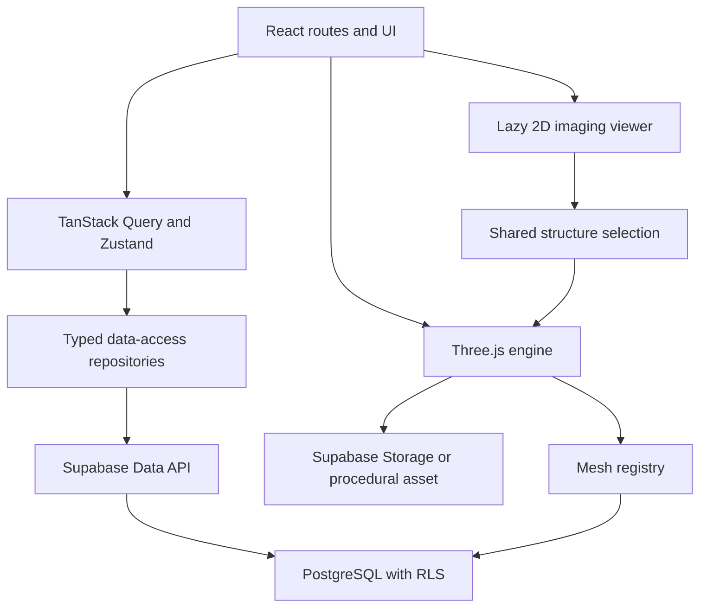

# Architecture

## Runtime layers

Dependencies flow toward stable domain IDs. Medical content does not depend on a mesh name, and the Three.js engine does not depend on a heart-specific React component.

## Public content path

MedicalContentBootstrap loads the selected system only. supabaseMedicalRepository validates critical responses with Zod, builds domain objects, and requests short-lived signed URLs for private published assets. TanStack Query caches system and bundle responses. The fallback covers every Stage 4 system. Imaging metadata loads only on imaging routes or tabs.

## Editorial path

AuthProvider owns the Supabase browser session and current profile. AdminGuard requires an active editor, reviewer, or admin profile. Admin components call adminRepository; PostgreSQL RLS independently enforces the same permissions. Client-side role checks improve UX but are not the security boundary.

Core updates trigger immutable JSON snapshots in content_versions and records in audit_log. Review decisions live in content_reviews.

## Three.js engine

- SceneManager: lifecycle and orchestration
- CameraManager: orbit, resize, reset, and GSAP focus
- ModelLoader: procedural and lazy GLB/GLTF loading; Draco/Meshopt extension points
- AssetCacheManager: reusable loaded-asset cache with cloned geometry and materials
- MeshRegistry: external mesh-name to anatomical-ID mapping
- SelectionManager and HighlightManager: raycasting and selected state
- LabelManager: simple and numbered study labels
- PhysiologyAnimator: reusable flow curves and particles
- PathologyVisualizer: data-driven materials, scale, animations, and future morph targets
- disposeObject: geometry, material, and texture cleanup

The atlas dynamically imports the viewer so public editorial pages do not pay the Three.js cost.

Full-body mode uses a simplified layered asset. `SceneManager.setSystemLayers` applies visibility and opacity by system metadata; detailed organ assets remain independently lazy-loaded.

## Extension contract

A future module provides database records for a system, structures, translations, relations, physiology, diseases, references, one or more versioned assets, and mesh mappings. The same repositories, stores, panels, and engine load it. Adding a published organ does not require editing a core TSX component.

## Security boundary

Only the Supabase URL and publishable key enter the browser. RLS restricts public reads to published, non-archived content. Storage is private and served through signed URLs after metadata policy checks. Privileged database credentials are never bundled in the frontend.
