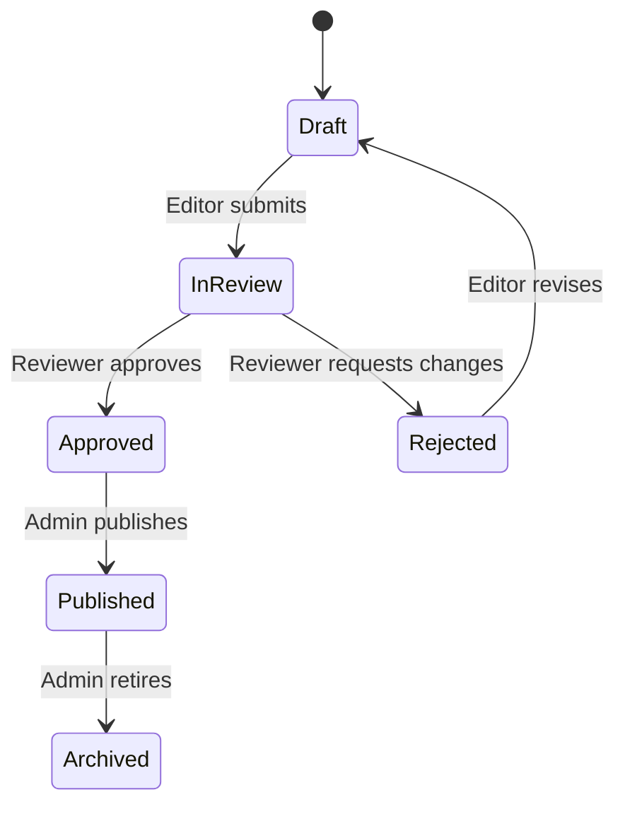

# Medical content workflow

## Integrity rules

- Public users read only published records.
- Editors cannot publish their own work through the normal workflow.
- A reviewer decision creates a content_reviews record with reviewer, notes, decision, and time.
- Core content changes create a content_versions snapshot and audit_log event.
- References can include a section_key and locator so future citations can attach to a specific content section.
- Rejected material remains recoverable and editable; published material is archived instead of routinely deleted.

## Required review checklist

Confirm terminology, Arabic and English meaning, anatomical relationships, physiological claims, disease staging, asset license/attribution, mesh mappings, and attached evidence. Visual pathology is educational unless validated clinical simulation data is explicitly supplied.
