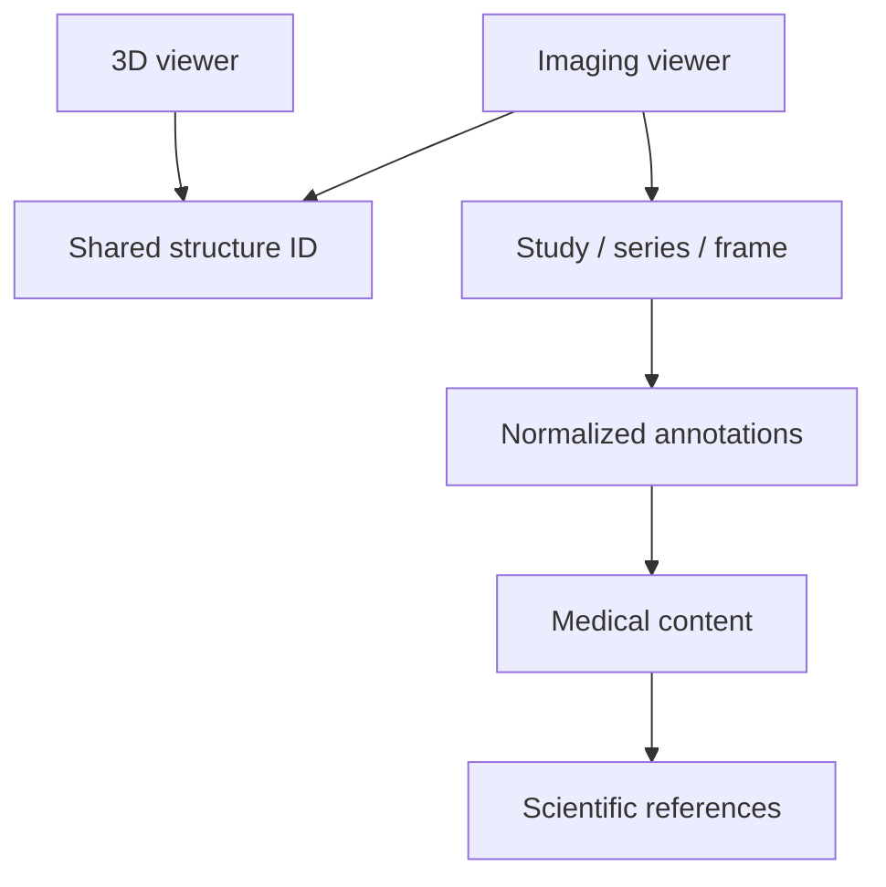

# Imaging architecture

The imaging route is dynamically isolated from the home page. `supabaseImagingRepository` retrieves one published study and validates the nested response with Zod. Private image paths receive short-lived signed URLs. If Supabase or a frame fails, local generated educational illustrations keep anatomy and text usable.

`imagingStore` owns study, series, frame, window preset, zoom, labels, 3D sync, and split-view state. `viewerStore.selectedStructureId` is the shared selection contract. Annotation clicks update it only when sync is enabled.

CT supports slice navigation and soft-tissue, lung, and bone display presets. MRI uses a generated T2-like axial series. X-ray uses a projection view. Histology supports zoom and point annotations. These generated visuals are illustrative and never represented as clinical scans.
