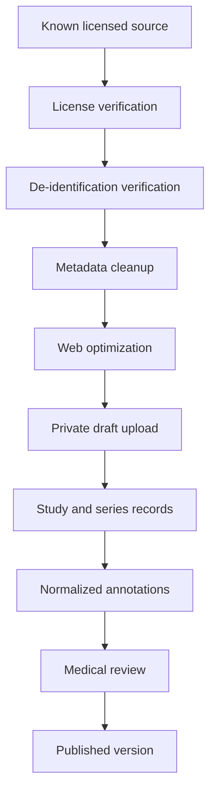

# Imaging asset pipeline

The public cannot upload medical images. Staff uploads accept PNG, JPEG, or WebP only, at most 25 MB per file and 100 frames per batch. The CMS decodes and re-encodes frames as WebP to remove EXIF. Visible patient identifiers still require human review; re-encoding is not a substitute for de-identification.

Raw clinical DICOM, PACS integration, diagnosis, lesion detection, and patient accounts are out of scope. A later privileged processor may validate DICOM, remove unsafe tags, create thumbnails, and produce web frames. The browser should not receive an entire raw series when nearby optimized frames suffice.

Suggested storage path: `medical-imaging/draft/{study}/{series}/frames/{index-version}.webp`. Published database records determine public object access through RLS-aware Storage policies.
